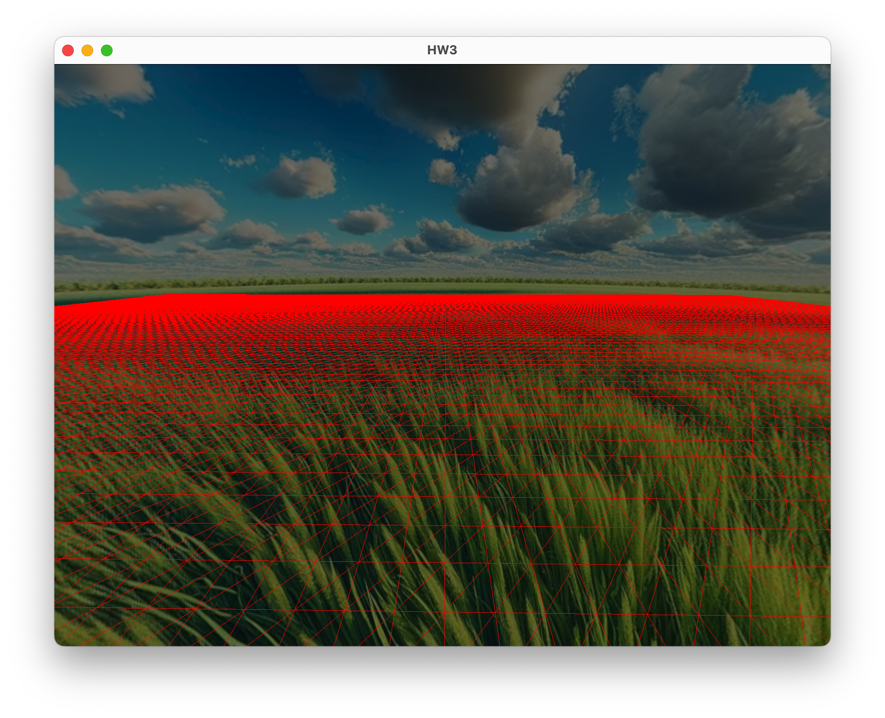
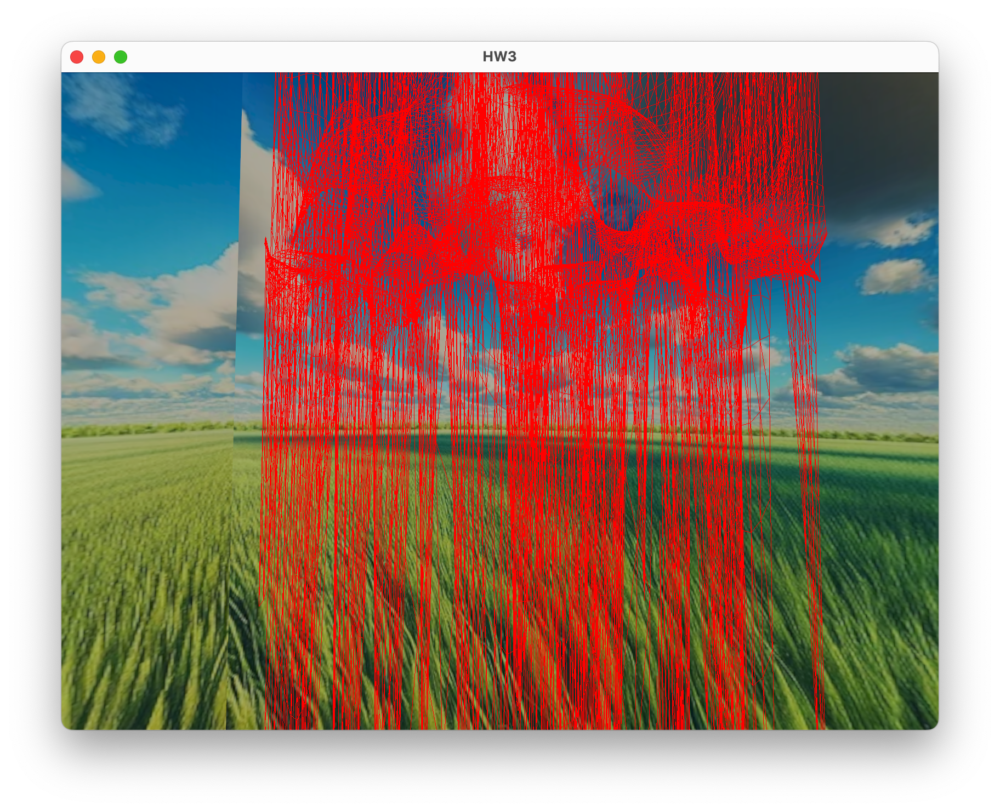
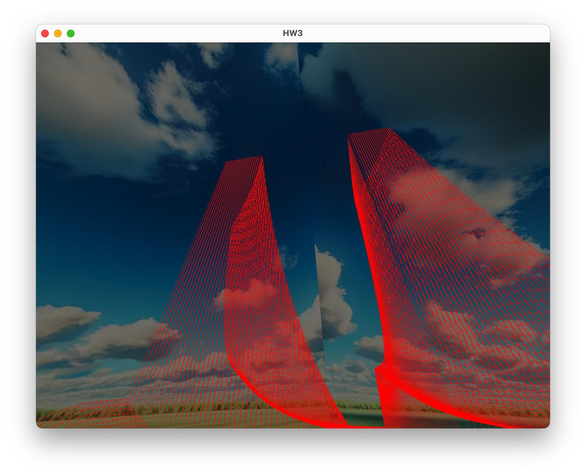
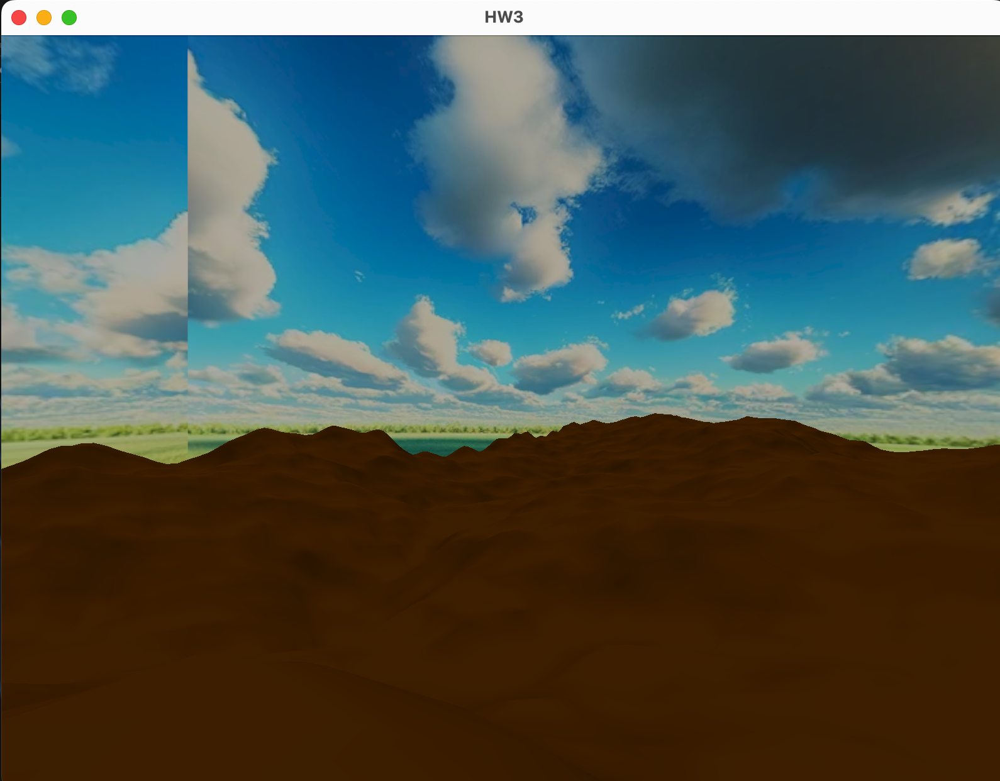
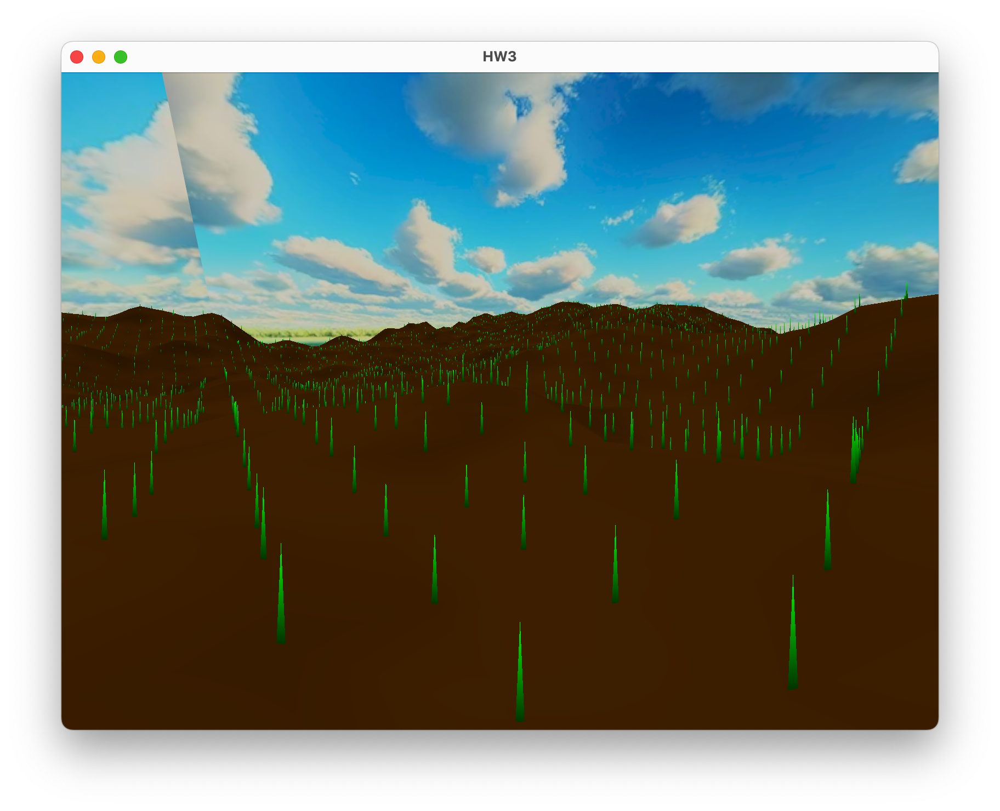
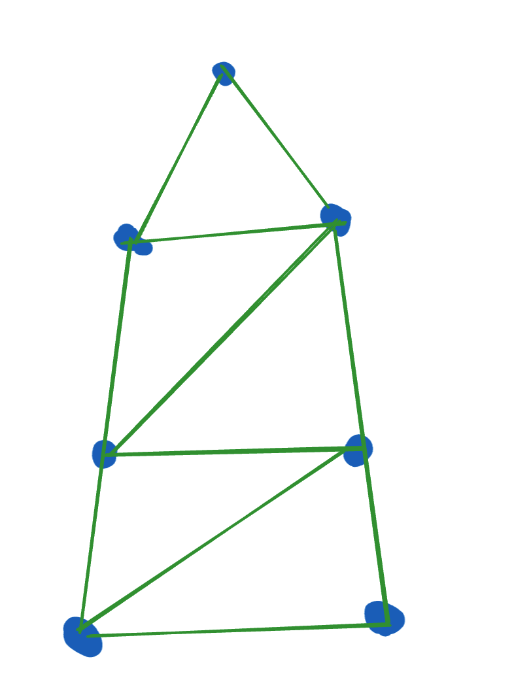
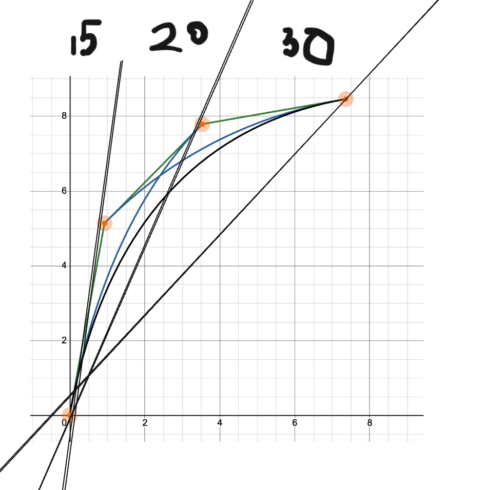
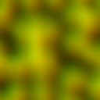
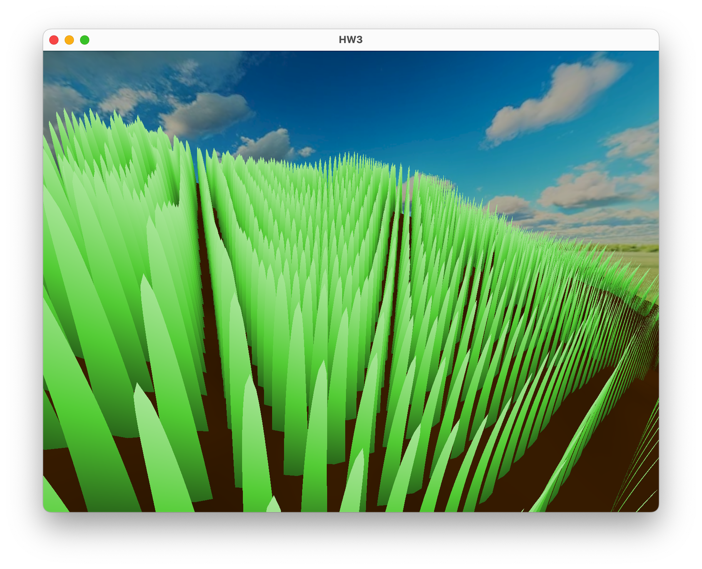
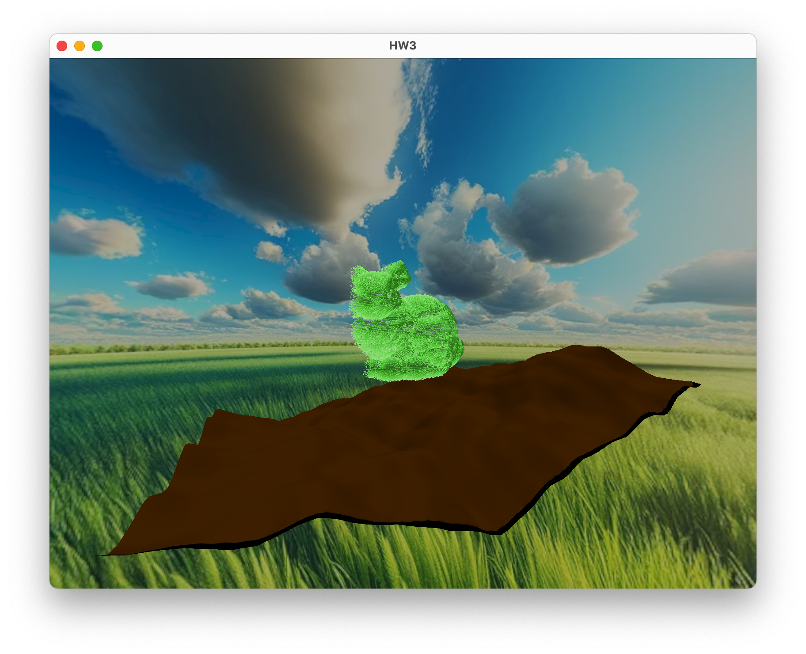

# CENG469 - HW3 Touching Grass Simulator

In this wonderful homework, I will be your ringmaster on how did I manage to _touch the grass_. In this project I implemented a grass simulation using geometry shaders and perlin noise. It was a hefty task but let look at the development process of it.


## Baseline

I started the project by copying my work from the previous homework ( if you still did not read the first blogpost, i highly recommend it was a hilarious journey for me :D )

## Ground Up

First things first, I had to create a plane that would represent the ground. I used a simple triangle mesh that was created when the program is first run.



Here is the first look of the plane. It is a simple triangle mesh that is created by two for loops that create the vertices of the plane. The plane is then rendered using the indices of the vertices. However, I wanted to make the plane look more like a grassy hills rather than a flat plane. Therefore I started to implement perlin noise functions to give the height that ground needs.

In order to implement perlin noise, I had done some research and gathered some of the sources on the internet. First we need a random gradients on a grid in order to create such noise. I used a simple random function to create the gradients. Then I created a function that would calculate the dot product of the gradients and the distance vectors of the grid points. This would give us the perlin noise that we need. 

```cpp
float perlin_noise(float x, float y){
    int x0 = (int)x;
    int x1 = x0 + 1;
    int y0 = (int)y;
    int y1 = y0 + 1;

    float sx = x - (float)x0;
    float sy = y - (float)y0;

    float n0 = dotGridGradient(x0, y0, x, y);
    float n1 = dotGridGradient(x1, y0, x, y);
    float ix0 = interpolate(n0, n1, sx);

    // Compute and interpolate bottom two corners
    n0 = dotGridGradient(x0, y1, x, y);
    n1 = dotGridGradient(x1, y1, x, y);
    float ix1 = interpolate(n0, n1, sx);


    return interpolate(ix0, ix1, sy);
}
```

Here is the function that I used to calculate the perlin noise. The `dotGridGradient` function calculates the dot product of the gradient and the distance vector. The `interpolate` function is used to interpolate the values of the grid points. The `perlin_noise` function is used to calculate the perlin noise of the given point.

But this was not enough. I needed to create a function that would create the perlin noise of the whole plane. I used a simple for loop to calculate the perlin noise of each point of the plane. 

This was way to easy in first sight, yet it was not... Here in the picture bellow you can see collection of my failed attempts of creating the perlin noise.



Here are some tangent-like spikes that produced by perlin noise... I still have no idea how did I manage to create such a thing.



This one especially looks like twin towers of New York. I was really confused at this point. I had no idea what was going wrong. But then I realized that the interpolation function I was using had a plus sign instead of a minus sign. This was the reason why I was getting such weird results. After fixing the interpolation function, I was able to get the perlin noise that I wanted.

After some coloring and some simple diffuse shading, here is the result.



## Side Quests

When I implemented the ground, I started to think "What if I could add walking on ground" then I started working on it. It was relatively easy actually. I added a function for the terrain object to fetch the height of the terrain at a given point. Then I added a camera that would move on the terrain. The camera would move on the terrain by following the height of the terrain at the point that it is currently at. This was a simple task but it was a fun one. Here you can see the camera moving on the terrain.


## Let There Be Grass

So the ground was ready to plant some juicy green _grass_. 

In order to create grass scattered around, I started to implement a geometry shader. What this geometry shader do is that it creates a grass blade for each vertex of the plane. The grass blade is created by creating a triangle and then moving the vertices of the triangle to create a grass blade. The grass blade is then rendered using the indices of the vertices. Color of the bottom verticies are set to dark green and the top vertex is set to lighter green. This creates a grass blade that looks like well.. a grass blade.

Here is the result of the grass blades.



They look kinda small and not so grassy. I wanted to make them look more like grass. Therefore I added a simple wind effect to the grass blades. I added some skew to the grass blades to make them look like they are being blown by the wind. This was a simple task but it made the grass look more like grass.

Here is the result of the grass blades with the simpler wind effect.


Oh this one was from a hurricane... I had to tone down the wind effect a little bit. 


And here is some more with varying colors


In the last gif, you might see how the grass swipes in a circular path, this is due to the fact that I used the same random value for the wind effect of all the grass blades. I wanted to make the grass blades look more natural. Therefore started to add more natural perlin noise driven wind effect to the grass blades.

But before doing this task, I needed a more flexible grass model. Since current model only uses 3 verticies, it was not enough to create a grass blade that would look like a grass blade. Therefore I started to create a more complex grass blade model. This model uses a triangle strip rather than a singlular triangle. How it is trianglulated can be seen in the image bellow.



From bottom to up each vertex is created and connected to the previous vertex. This creates a grass blade that contains any number of segments. Each segment can be moved independently to create a more natural looking grass blade. 

In order to bend each blade of grass, I implemented a custom bezier curve. This curve starts from the bottom of the grass and end at the top. Height of each segment of grass is calculated using this curve. Control points of the grass is bent using three parameters. These parameters are the height of the grass, speed of wind, and the direction of the wind. These parameters are used to calculate the control points of the bezier curve. The bezier curve is then used to calculate the height of each segment of the grass.

Here is the desmos representation of the bezier curve that I used.



And now the final part... the winds. In order to have nicer winds I implemented winds based on perlin noise. However creating perlin noises on the gpu is a heavy duty task. Therefore I created a texture that would contain the perlin noise. This texture is then used to calculate the wind effect of the grass blades. The wind effect is calculated using the perlin noise texture and the position of the grass blade. The wind effect is then used to move the grass blade in the direction of the wind. This creates a more natural looking wind effect on the grass blades.

First I tought adding wind textures with different frequencies to create a more natural and not tiling wind effect. However, this was a little overwhelming for me. Therefore I decided to use a single perlin noise texture to create the wind effect.

Here is the windmap generated by the perlin noise.



Here is the final result of the grass blades with the bezier curve using perlin noise winds.




And here is a bunny that made out of grass



## Conclusion

This was a fun project. I learned a lot about perlin noise and how to use it to create natural looking effects. I also learned how to create a geometry shader and how to use it to create complex models. I also learned how to create a bezier curve and how to use it to create natural looking grass blades. This was a fun project and I am happy with the results. I hope you enjoyed reading this blogpost as much as I enjoyed writing it.


